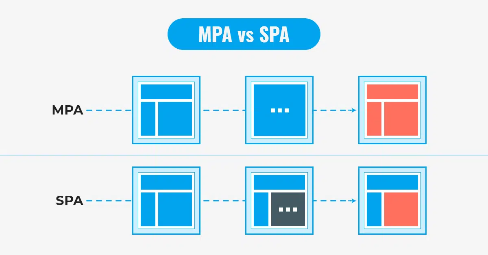

# 봉원철 201930217
<details>
<summary>5월 1일 강의(보강)</summary>

useState:
useState는 React에서 상태(state)를 관리하는 Hook 중 하나입니다. 이 Hook은 함수 컴포넌트에서 상태를 추가할 수 있게 해주고, 해당 상태의 값을 변경할 수 있는 함수를 반환합니다. 
<br>
useEffect:
useEffect는 React 컴포넌트의 생명주기에 특정한 동작을 수행하도록 하는 Hook입니다. 컴포넌트가 렌더링될 때마다 실행되거나, 특정 상태나 prop이 변경될 때 실행되도록 설정할 수 있습니다. 이를 통해 데이터 fetching, 구독 설정, 수동으로 수행해야 하는 리소스 정리 등의 작업을 수행할 수 있습니다. 
<br>

</details>
4월24일 중간 평가 깃허브 연결확인용 commit
<br><br>
<details>
<summary>4월 17일 강의</summary>

훅이란?
- 훅(Hook)은 React의 새로운 기능 중 하나로, 함수 컴포넌트에서 상태(state) 및 다른 React 기능을 사용할 수 있게 해줍니다.

useState
- useState 훅은 React 컴포넌트에서 상태를 추가할 수 있도록 해주는 특별한 함수입니다. 이를 통해 함수 컴포넌트에서도 상태를 관리할 수 있게 됩니다.

```jsx
import React, { useState } from 'react';

function ExampleComponent() {
  const [count, setCount] = useState(0);

  return (
    <div>
      <p>You clicked {count} times</p>
      <button onClick={() => setCount(count + 1)}>Click me</button>
    </div>
  );
}

export default ExampleComponent;
```

useEffect
- useEffect 훅은 React 컴포넌트가 렌더링될 때마다 특정 작업을 수행하도록 설정할 수 있습니다. 이를 통해 데이터를 가져오거나 구독을 설정하는 등의 작업을 수행할 수 있습니다.

```jsx
import React, { useState, useEffect } from 'react';

function ExampleComponent() {
  const [count, setCount] = useState(0);

  useEffect(() => {
    document.title = `You clicked ${count} times`;
  }, [count]);

  return (
    <div>
      <p>You clicked {count} times</p>
      <button onClick={() => setCount(count + 1)}>Click me</button>
    </div>
  );
}

export default ExampleComponent;

```

</details><br>


<details><summary>4월 10일 강의</summary>
공휴일 수업 X
</details><br>

<details><summary>4월 3일 강의</summary>

<h3>함수형 컴포넌트</h3>
함수형 컴포넌트는 React에서 컴포넌트를 정의하는 데 사용되는 하나의 방법입니다. 이는 함수로 구성되어 있으며, 주어진 입력(props)에 대해 UI를 반환합니다. 함수형 컴포넌트는 간단하고 가독성이 높으며, React Hooks를 이용하여 상태 관리와 생명주기를 다룰 수 있습니다.

```

```

 
<h3>클래스형 컴포넌트</h3>
클래스형 컴포넌트는 React의 초기 버전에서 사용되었던 컴포넌트 정의 방식입니다. ES6 클래스를 이용하여 정의되며, React.Component 클래스를 상속받습니다. 클래스형 컴포넌트는 state와 생명주기 메서드를 직접 다룰 수 있습니다. 하지만 클래스형 컴포넌
트는 코드가 복잡해질 수 있고, 클래스 바인딩과 메서드 정의 등의 추가 작업이 필요합니다.

<h3>컴포넌트 합성</h3>
- 컴포넌트 합성은 여러 컴포넌트를 합쳐서 하나의 컴포넌트를 만드는 것입니다.
<h3>컴포넌트 추출</h3>
- 복잡한 컴포넌트를 쪼개서 여러 개의 컴포넌트로 나눌 수도 있습니다.
</details><br>

<details><summary>3월 27일 강의</summary>
    <h2>JSX의 역할</h2>
    jsx는 내부적으로 XML/HTML 코드를 자바스크립트로 변환합니다.<br>
    React가 createElemnet함수를 사용하여 자동으로 자바스크립트로 변환해 줍니다.<br>
    만일 JS로 작업할 경우 직접 createElement함수를 사용해야 합니다.<br>
    결국 JSX는 가독성을 높여 주는 역할을 합니다.<br>
    <h3>JSX의 장점</h3>
    코드가 간결해 집니다.<br>
    가독성이 향상 됩니다.<br>
    Injection Attack이라 불리는 해킹 방법을 방어함으로써 보안에 강합니다.<br><br>
    <h2>요약</h2>
    JSX란?<br>
    -자바스크립트와 XML/HTML을 함께 사용할 수 있는 자바스크립트의 확장 문법<br>
    <br>JSX의 역할<br>
    -JSX로 작성된 코드는 모두 자바스크립트 코드로 변환<br>
    -리액트는 JSX 코드를 모두 createElement() 함수를 사용하는 코드로 변환<br>
   <br> JSX의 장점<br>
    -코드가 간결해짐<br>
    -가독성 향상<br>
    -Injection Attack을 방어함으로써 보안성이 올라감<br>
   <br> JSX사용법<br>
    -기본적으로 모든 자바스크립트 문법을 지원<br>
    -자바스크립트에 XML과 HTML을 섞어서 사용<br>
    -중괄호를 사용하여 자바스크립트 코드를 삽입<br><br>
    <h1>엘리먼트 렌더링</h1>
    <h2>엘리먼트의 정의</h2>
    엘리먼트는 리액트 앱을 구성하는 요소를 의미합니다.<br>
    공식페이지에는 "엘리먼트는 리액트 앱의 가장 작은 빌딩 블록들"이라고 설명하고 있습니다.<br>
    웹 사이트의 경우는 DOM 엘리먼트이며 HTML요소를 의미합니다.<br><br>
<h1>컴포넌트와 props</h1>
<h2>컴포넌트에 대해 알아보기</h2><br>
- 리액트는 컴포넌트 기반의 구조를 갖습니다.<br>
- 컴포넌트 구조라는 것은 작은 컴포넌트가 모여 큰 컴포넌트를 구성하고, 다시 이런 컴포넌트들이 모여서 전체 페이지를 구성한다는 것을 의미합니다.<br>
- 컴포넌트 재사용이 가능하기 때문에 전체 코드의 양을 줄일 수 있어 개발 시간과 유지 보수 비용도 줄일 수 있습니다.<br>
- 컴포넌트는 자바스크립트 함수와 입력과 출력이 있다는 면에서는 유사합니다.<br>
- 다만 입력과 출력은, 입력은 Props가 담당하고, 출력은 리액트 엘리먼트의 형태로 출력됩니다.<br>
- 엘리먼트를 필요할 만큼 만들어 사용한다는 면에서는 객체 지향의 개념과 비슷합니다.<br>
<h2>Props에 대해 알아보기</h2><br>
props는 prop(property: 속성, 특성)의 준말입니다.<br>
이 props가 바로 컴포넌트의 속성입니다.<br>
컴포넌트에 어떤 속성, props를 넣느냐에 따라서 속성이 다른 엘리먼트가 출력됩니다.<br>
porps는 컴포넌트에 전달 할 다양한 정보를 담고 있는 자바스크립트 객체입니다.<br>
에어비엔비의 예도 마찬가지입니다.<br>
<h2>Props의 특징</h2><br>
읽기 전용입니다. 변경할 수 없다는 의미입니다.<br>
속성이 다른 엘리먼트를 생성하려면 새로운 props를 컴포넌트에 전달하면 됩니다.<br>


</details><br>

<details>
    <summary>3월 20일 강의</summary>
    <h2>1.리액트의 정의</h2><br>
    'Th e library for web and native user interfaces'<br>
    사용자 인터페이스를 만들기 위한 자바스크립트 라이브러리<br><br>
    <h4> 2.다양한 자바스크립트 UI 프레임워크: Stack overflow trends</h4>
    <h4 >3.리액트 개념 정리</h4>
    - 복잡한 사이트를 쉽고 빠르게 만들고, 관리하기 위해 만들어진 것이 바로 리액트입니다.
    <br> 
    - 다른 표현으로는 SPA를 쉽고 빠르게 만들 수 있도록 해주는 도구라고 생각하면 됩니다.
<h2>1.2 리액트의 장점</h2>
<h4>1.빠른 업데이트와 렌더링 속도</h4>
- 이 것을 가능하게 하는 것이 바로 Virual DOM입니다.<br>
- DOM이란 XML, HTML 문서의 각 항목을 계층으로 표현하여 생성, 변형, 삭제할 수 있도록 돕는 인터페이스입니다. 이 것은 W3C의 표준입니다.<br>
- Virtaul DOM은 DOM 조작이 비효율적인 이유로 속도가 느리기 때문에 고안된 방법입니다.<br>
- DOM은 동기식, Virtual DOM은 비동기식 방법으로 렌더링을 합니다<br>
  
<h4>2.컴포넌트 기반 구조</h4>
- 리액트의 모든 페이지는 컴포넌트로 구성됩니다.<br>
- 하나의 컴포넌트는 다른 여러 개의 컴포넌트의 조합으로 구성할 수 있습니다.<br>
- 그래서 리액트로 개발을 하다 보면 레고 블록을 조립나는 것처럼 컴포넌트를 조합해서 웹사이트를 개발하게 됩니다.<br>
- 아래 그림은 에어비앤비 사이트 화면의 컴포넌트 구조 입니다. 재사용성이 뛰어납니다.<br>
<h4>3.메타에서 오픈소스 프로젝트로 관리하고 있어 계속 발전함</h4>
<h4>4.활발한 지식 공유와 커뮤니티</h4>
<h4>5.모바일 앱 개발가능</h4>
<h2>1.2 리액트의 단점</h2>
<h4>1.방대한 학습량</h4>
<h4>2.높은 상태 관리 복잡도</h4>

</details><br>
<details>
    <summary>3월 13일 강의</summary>
        <details>
            <summary>HTML 살펴보기</summary>
            &nbsp;&nbsp;&nbsp;&nbsp;1. html이란 무엇인가?<br>
            &nbsp;&nbsp;&nbsp;&nbsp;2. 웹사이트의 뼈대를 구성하는 태그들<br>
            &nbsp;&nbsp;&nbsp;&nbsp;3. SPA(Single Page Application)<br>
            
        </details>
        <details>
            <summary>자바스크립트</summary>
            &nbsp;&nbsp;&nbsp;&nbsp;1. 자바스크립트란 무엇인가?<br>
            &nbsp;&nbsp;&nbsp;&nbsp;2. ES6(ECMAScript6) - 표준 ECMA-262<br>
            &nbsp;&nbsp;&nbsp;&nbsp;3. 자바스크립트의 자료형<br>
            &nbsp;&nbsp;&nbsp;&nbsp;&nbsp;&nbsp;&nbsp;&nbsp;● var: 중복 선언 가능, 재할당 가능<br>
            &nbsp;&nbsp;&nbsp;&nbsp;&nbsp;&nbsp;&nbsp;&nbsp;● let: 중복 선언 불가능, 재할당 가능<br>
            &nbsp;&nbsp;&nbsp;&nbsp;&nbsp;&nbsp;&nbsp;&nbsp;● const: 중복 선언 불가능, 재할당 불가능<br>
            &nbsp;&nbsp;&nbsp;&nbsp;&nbsp;&nbsp;&nbsp;&nbsp;● Array type: 배열<br>
            &nbsp;&nbsp;&nbsp;&nbsp;&nbsp;&nbsp;&nbsp;&nbsp;● Object type<br>
            &nbsp;&nbsp;&nbsp;&nbsp;4. 자바스크립트의 연산자<br>
            &nbsp;&nbsp;&nbsp;&nbsp;&nbsp;&nbsp;&nbsp;&nbsp;
            비교 연산자, 동등 연산자/일치 연산자, 이진 논리 연산자, 삼항 연산자...<br>
            &nbsp;&nbsp;&nbsp;&nbsp;5. 자바스크립트의 함수<br>
            &nbsp;&nbsp;&nbsp;&nbsp;&nbsp;&nbsp;&nbsp;&nbsp;
            Function statement형: 일반적인 함수의 형태<br>
            &nbsp;&nbsp;&nbsp;&nbsp;&nbsp;&nbsp;&nbsp;&nbsp;
            Arrow function expression형: 화살표 함수<br>
            
            
            
</details>
        </details>
        
</details></details><br>
<details><summary>3월 7일 강의</summary>

# h1
## h2
### h3
#### h4
##### h5
###### h6

# 리스트
1. 첫 번째
2. 두 번째
3. 세 번째

* 첫 번째
* 두 번째

- 첫 번째
- 두 번째

*이탤릭체*
**볼드**
***이탤릭체&볼드***

개행은  
스페이스 두 개

```js
const a = 1;
let b = 2;
//코드
```

[구글 링크](http://google.com)

[페이지내 h3로 이동](#h3)

---
<details>
<summary><strong>접기</strong>/펼치기</summary>
접기/<strong>펼치기<strong>
<!--  이미지 -->
</details>
</details>